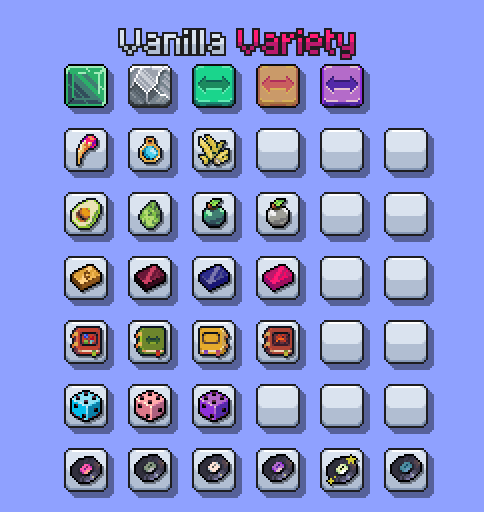
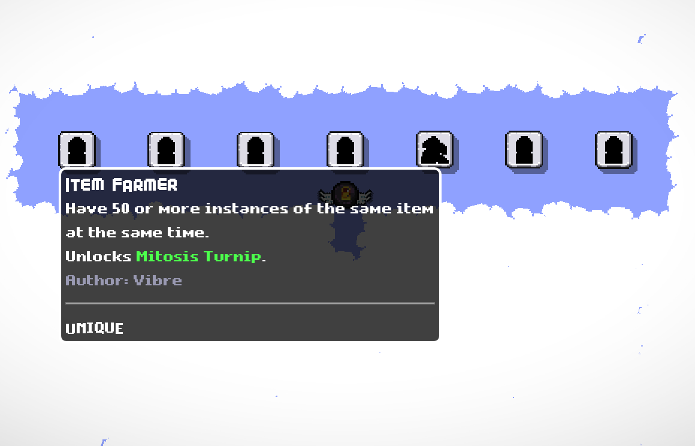
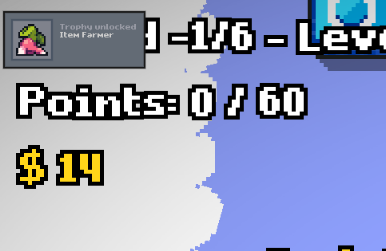
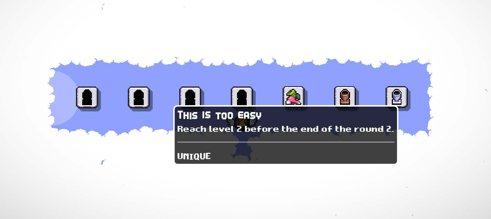
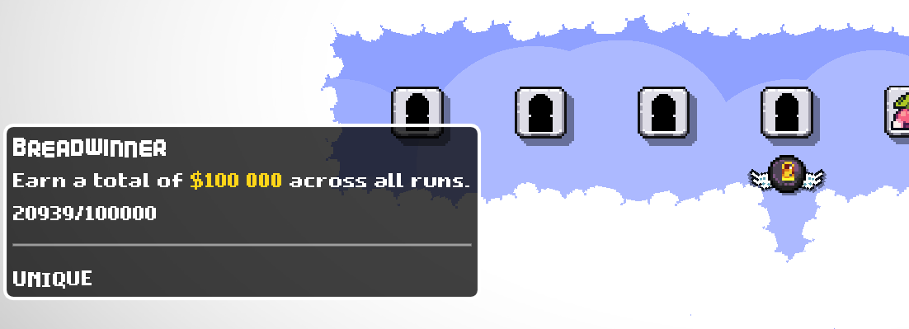

# DSH Lootplot Mods #

A collection of small mods for the Lootplot game.

## Vanilla Variety (`dsh.vv`) ##

A mod I've made as an exercise with Lootplot modding API. Adds several new slots, a couple new foods to spawn those slots, and an assortment of items.

## Trophy Territory (`dsh.tt`) ##

Adds in-game trophy/achievement tracking, which the community came up with. Adds in-game popup to indicate trophy unlocks. Adds items, which are unlocked by some trophies. Adds a separate level, which shows all trophies and their status.

Full trophy and rewards list can be found in the mod's [README.md](/dsh.tt/README.md)

## DSH Debug (`dsh.dbg`) ##

A devtools mod, which adds a couple of commands to spawn items and slots in a more convenient manner:
- `/ss [slot_type="slot"] [radius=0]` - spawns a slot with the given type in a (radius * 2 + 1) x (radius * 2 + 1) grid. If radius is omitted, will spawn a single slot. If slot type is omitted, will spawn a normal slot.
- `/si item_type` - spawns an item with the given item type at the center of the screen. If there's no slot available, traverses the screen in a spiral, looking for a suitable slot. If there's no item with given item type, looks up the closest match by name.
- `/` - repeats the last `si` or `ss` command.

## Credits ##

- https://jamiebrownhill.itch.io/solaria-food-drink-icon
- https://mtk.itch.io/grenades-16x16
- The rest of the graphical assets are recolored or otherwise adjusted assets from the [official sources](https://github.com/UntitledModGame/umg-mods/tree/master/lootplot.s0).
- Some code snippets are borrowed from the [official sources](https://github.com/UntitledModGame/umg-mods/tree/master).

### Installation ###

1. Download this repository.
2. Open the desired mod folder.
3. Run `install.bat` from within the folder.

Or run `install-all.bat` from the root folder if you'd like to install all available mods.

### Manual Installation ###

1. Download this repository.
2. Copy any desired mod folder into `%APPDATA%/Roaming/lootplot/mods`.
3. Copy `dsh.lib` contents into the `%APPDATA%/Roaming/lootplot/mods/[mod]` folder, merging the corresponding `server`, `client` and `shared` subfolders' contents.