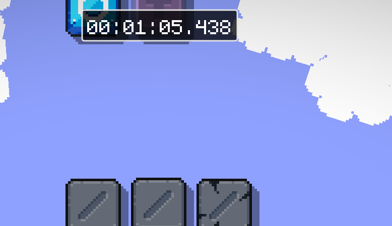

# DSH Lootplot Mods #

A collection of mods for the Lootplot game.

## Community Creations (`dsh.cc`) ##

A bunch of random community ideas implemented as a mod. See the [README.md](/dsh.cc/README.md) for the full list and credits.

## Trophy Territory (`dsh.tt`) ##

Adds in-game trophy/achievement tracking, which the community came up with. Adds in-game popup to indicate trophy unlocks. Adds items, which are unlocked by some trophies. Adds a separate level, which shows all trophies and their status.

Full trophy and rewards list can be found in the mod's [README.md](/dsh.tt/README.md)

## Quirky Quality (`dsh.qq`) ##

Adds some quality of life things into the game: item search, filtering, overlays, a run timer. See the mod's [README.md](/dsh.qq/README.md) for more details.

## Daunting Difficulty (`dsh.dd`) ##

Increases the difficulty by making certain synergies less viable. Reduces the effectiveness of some overpowered items or mechanics. Patches an exploit. See the mod's [README.md](/dsh.dd/README.md) for the full list of changes and available configuration.

## Vanilla Variety (`dsh.vv`) ##

My first creation. Made as an exercise with Lootplot modding API. Adds several new slots, a couple new foods to spawn those slots, and an assortment of items.

## DSH Debug (`dsh.dbg`) ##

A devtools mod, which adds a couple of commands to spawn items and slots in a more convenient manner:
- `/ss [slot_type="slot"] [radius=0]` - spawns a slot with the given type in a (radius * 2 + 1) x (radius * 2 + 1) grid. If radius is omitted, will spawn a single slot. If slot type is omitted, will spawn a normal slot.
- `/si item_type` - spawns an item with the given item type at the center of the screen. If there's no slot available, traverses the screen in a spiral, looking for a suitable slot. If there's no item with given item type, looks up the closest match by name.
- `/` - repeats the last `si` or `ss` command.

## DSH Lib (`dsh.lib`) ##

A collection of utility and cool hacks, which enable other mods' functionality. Isn't used on its own, and instead is included with every mod distribution.

## Credits ##

- Art:
	- https://jamiebrownhill.itch.io/solaria-food-drink-icon
	- https://mtk.itch.io/grenades-16x16
	- https://crusenho.itch.io/icons-essential-pack-free-icons
	- https://free-game-assets.itch.io/free-sky-with-clouds-background-pixel-art-set
	- Twitter's [Twemoji](https://github.com/twitter/twemoji)
	- The rest of the graphical assets are recolored or otherwise adjusted assets from the [official sources](https://github.com/UntitledModGame/umg-mods/tree/master/lootplot.s0) or made from scratch by me.
- Fonts:
	- [monogram](https://datagoblin.itch.io/monogram) by datagobling
	- [nico pixel fonts](https://emhuo.itch.io/nico-pixel-fonts-pack) by emhuo
	- [free cheese](https://ggbot.itch.io/free-cheese-font) by ggbot
- Code:
	- Some code snippets are borrowed from the [official sources](https://github.com/UntitledModGame/umg-mods/tree/master).
	- No AI has been used, I wrote all of this garbage by hand.

### Installation ###

1. Download this repository.
2. Open the desired mod folder.
3. Run `install.bat` from within the folder.

Or run `install-all.bat` from the root folder if you'd like to install all available mods.

### Manual Installation ###

1. Download this repository.
2. Copy any desired mod folder into `%APPDATA%/Roaming/lootplot/mods`.
3. Copy `dsh.lib` contents into the `%APPDATA%/Roaming/lootplot/mods/[mod]` folder, merging the corresponding `server`, `client` and `shared` subfolders' contents.