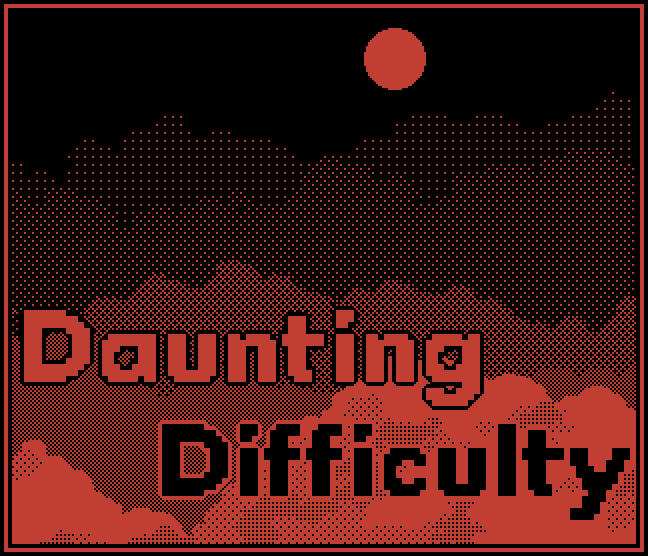

# Daunting Difficulty #

Increases the game difficulty, and makes some game-breaking mechanics less viable.

## Overrides and Effects ##

- **Stable Injunctions.** You may no longer spawn shop or reroll slots under injunctions. They will be immediately turned into doomed null slots. Magic wand may no longer target injunctions. This makes injunctions much harder to completely remove.
- **Edible Sacks.** All sack items are treated as food. This disables some interactions for sacks, like easy cloning.
- **Rare Sacks.** Big and epic sacks have an increased rarity, which makes them spawn less often in shops. You can also no longer find a big or epic sack in an uncommon sack loot.
- **One Sided Keys.** Keys no longer have two targets by default. This makes you either produce and spawn more keys, or find ways to rotate them more often.
- **Shields Don't Affect Shields.** Shields no longer can target each other or themselves. This reduces your ability to create cheap repeater and doom counter machines.

## Customizing ##

All overrides are in effect by default. You can toggle any of them off by opening `dsh.dd/shared/config.lua` with any text editor and editing the config table.

## Known Issues ##

This mod has to redefine some existing items, which will screw up your compendium.