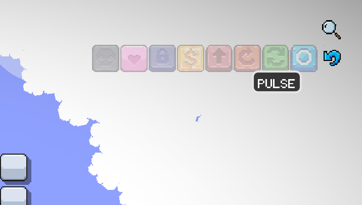
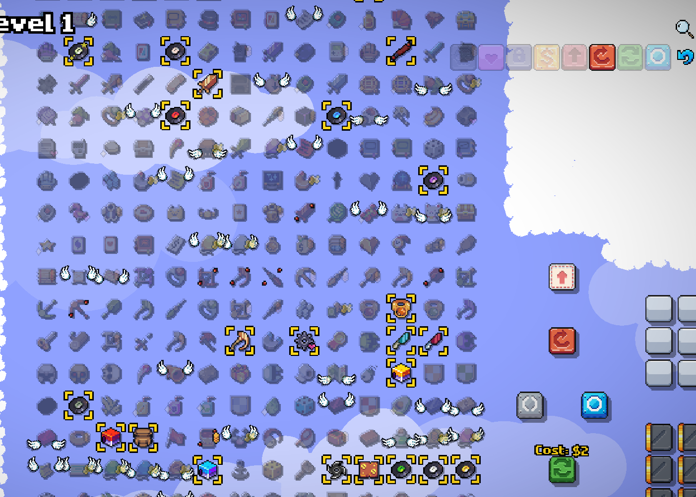

# Quirky Quality #

Adds some quality of life improvements into the game.

## Reroll Slots ##

Displays padlock icons on locked reroll slots. Will display a padlock even if the slot is empty, which is useful to make sure that your doomed reroll slots aren't wasting away on rerolls.

## Item Search ##

Allows to search items by name or description. Usage:

1. Click the magnifying glass at the top right.
2. A chat box will open, enter your search term after `/q`. For example `/q coin`.
3. Any matching item will be highlighted, non-matching items will be faded.
4. To reset back either click the magnifying glass again or enter `/q` command with no other arguments.

## Trigger Filter ##

Allows filtering items by their triggers. Usage:

1. Click on the blue arrow icon at the top right.
2. A panel with all available triggers will open.
3. Click on one ore more trigger buttons.
4. All items, which have at least one of the selected triggers will be highlighted. Non-matching items will fade.
5. To reset and close the panel, click on the blue arrow button again.
