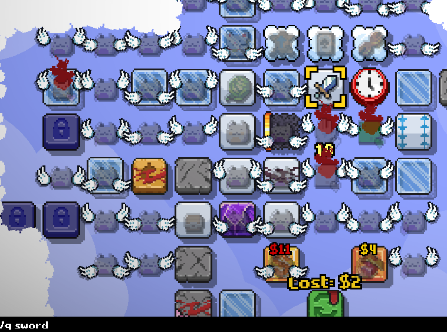
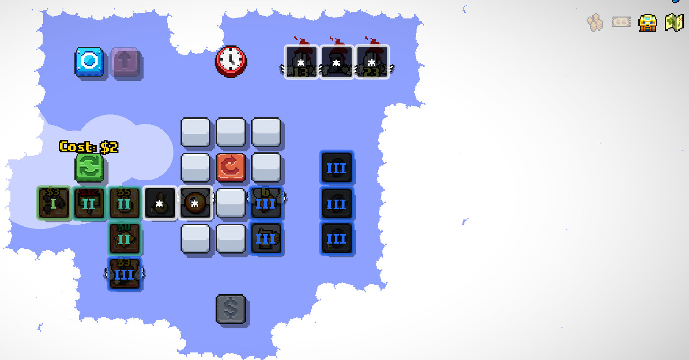
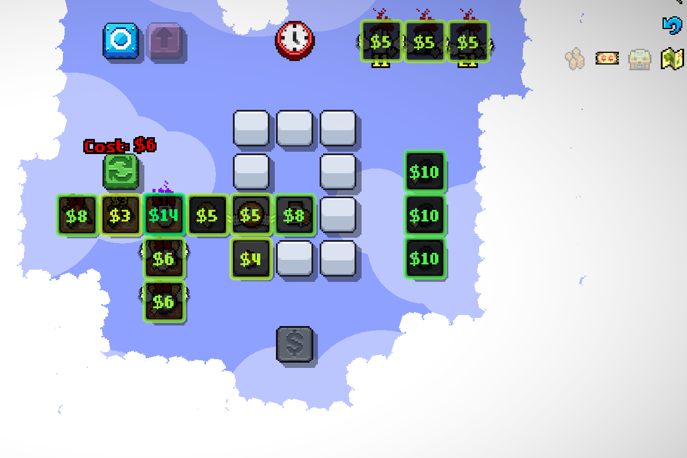
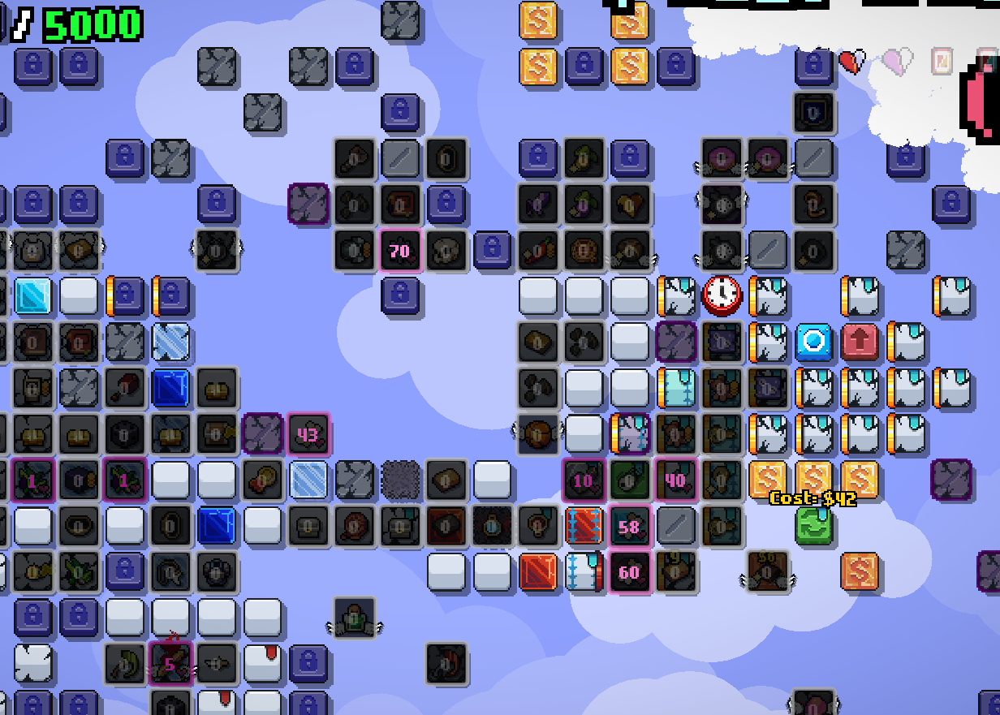

# Quirky Quality #

Adds some quality of life improvements into the game.

## Reroll Slots ##

Displays padlock icons on locked reroll slots. Will display a padlock even if the slot is empty, which is useful to make sure that your doomed reroll slots aren't wasting away on rerolls.

## Item Search ##

Allows to search items by name or description. Can be optionally combined with item overlays. Usage:

1. Click the magnifying glass at the top right.
2. A chat box will open, enter your search term after `/q`. For example `/q coin`.
3. Any matching item will be highlighted, non-matching items will be faded.
4. To reset back click the magnifying glass again.

## Trigger Filter ##

Allows filtering items by their triggers. Can be optionally combined with item overlays. Usage:

1. Click on the blue arrow icon at the top right.
2. A panel with all available triggers will open.
3. Click on one ore more trigger buttons.
4. All items, which have at least one of the selected triggers will be highlighted. Non-matching items will fade.
5. To reset and close the panel, click on the blue arrow button again.

## Item Overlay ##

Displays item data in a color-coded overlay type of deal. Can be combined with trigger filters or item search.

1. Click on the map icon at the top right.
2. A list of all available overlays will show up.
3. Click on the desired overlay.
4. The corresponding data will be shown on top of every item.
5. To reset, click the same overlay button again, or close the overlay panel by clicking the map once more.

Currently supported overlays are:

- Item rarity.
- Item price.
- Item money income per activation.
- Item total activations.
- Remaining activations.
- Remaining doom count.
- Remaining extra lives.