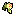

# Trophy Territory #

Adds community trophy tracking. Some trophies unlock additional items to look for and use in subsequent runs. Adds a toast notification when a trophy is unlocked. Adds a separate trophy ball level, which shows all trophies, their status and other information.

## Trophies and Unlocks ##

-  **Good start**. Get 1000 points before level 1 ends.
-  **This is too easy**. Reach level 2 before the end of the round 2.
-  **Item farmer**. Have 50 or more instances of the same item at the same time. 
	- Unlocks **Mitosis Turnip**. Duplicates the target item twice, and places duplicates to the left and to the right of itself. Doesn't work on food.
	- Original idea by Vibre https://discord.com/channels/863625920991854602/1437782806582399027/1437782806582399027.
-  **Cursed onslaught**. Accumulate at least 20 curses on the board before level 1 ends, and win the game without ever going below 20 curses.
	- Unlocks **Crusader's Shield**. Drains all activations from target curses, does not affect injuctions.
-  **If it bleeds**. Destroy 5 curses in a single run.
	- Unlocks **Ethereal Dagger**. Destroys target curses. Doesn't affect other items.
-  **The purge**. Destroy 100 curses across all runs.
	- Unlocks **Holy Hand Grenade**. Halves the lives of all curses in range, then destroys them.
	- Item icon is a recolored sprite from https://mtk.itch.io/grenades-16x16
-  **Cursed race**. Win a daily run before a stone hand has a chance to spawn any curses.
	- Unlocks **Petrified Heart**. Spawns a DOOMED-1 null slot under target curses.
-  **Looking around**. Clear 10000 slots from fog across all runs.
	- Unlocks **Map Scrap**. Reveals fog in a random area.
-  **Keeping to yourself**. Win a run with 150 or less revealed slots.
-  **Enduring explorer**. Reveal every tile on the plot.
	- Unlocks **Honey Jar**. Makes locked slots earn +$5.
	- Item icon is a recolored sprite from https://jamiebrownhill.itch.io/solaria-food-drink-icon demo.
-  **The breadwinner**. Earn a total of $100 000 across all runs.
-  **Savings**. Have $100 at one time.
-  **College fund**. Have $1000 at one time.
-  **Dragon hoard**. Have $10000 at one time.
